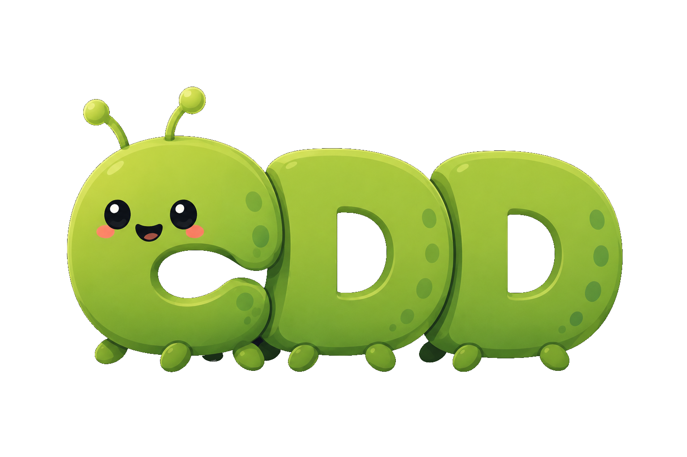

<p align="center">
  
</p>

CDD is a way to organize software so developers can find the right code by meaning, not by framework trivia.

```bash
git clone https://github.com/gvlasov/cdd.git
cd cdd
./install

cdd help
cdd print
```

`./install` installs CDD support for the tools available on this machine.

`cdd help` shows the project command language.
`cdd print` prints the indexed source tree so LLM can read the whole project as context.

## Inspiration

CDD is a complete implementation of the idea of a [screaming architecture](https://blog.cleancoder.com/uncle-bob/2011/09/30/Screaming-Architecture.html) by Bob Martin.

CDD also borrows from

- [Ontology](https://en.wikipedia.org/wiki/Ontology) as a philosophical study of being
- Wikipedia-style article organization - everything about a single concept lives in a single place
- [Obsidian](https://obsidian.md)
- Feature-sliced architecture (pushing it to its logical end)

## The Terms You Need

CDD is built around a few words that explain where things belong:

- `concept`: the thing you are building about, like orders, users, or invoices.
- `reflection`: any file that expresses a concept, such as code, docs, tests, UI, or jobs.
- `stakeholder`: a person or group who cares about the project, such as users, owners, developers, operators etc.
- `process`: a state change over time that represents interoperation of multiple concepts, an example of such change would be refinement, settlement, import, export.
- `platform`: tool and runtime support, such as bash, fish, Docker, or an IDE plugin.
- `command`: an action developers run from localhost, such as `help`, `install`, `tests`, `ssh:prod`, `build`, `lint` or `deploy`.

## Why it exists

Most codebases scatter one feature across technical directories:

- model in one place
- tests in another
- UI in another
- docs somewhere else
- runtime wiring split again

That makes ordinary work expensive:

- one change turns into directory hopping
- it is hard to answer "where does this file go?"
- LLMs have to reconstruct context from fragments

CDD reduces that friction by grouping files by the thing they mean.

## What CDD gives you

Open the concept, stakeholder, or process that matters and the whole picture is nearby:

```text
/concepts/orders/
  Order.php
  Order.vue
  OrderRepository.php
  SettleOrders.php
  README.md

/stakeholders/
/processes/
/platform/
/commands/
```

This makes a project easier to:

- navigate
- explain
- extend
- hand to another developer
- feed to an LLM as context

## The directory tree

CDD dictates a specific directory tree:

- `/concepts` holds the problem-domain concepts and their reflections.
- `/platform` holds tools, runtime support, and integration code.
- `/processes` holds workflows and ordered changes over time.
- `/commands` holds project actions developers are meant to run.
- `/stakeholders` holds people and groups who care about the project.
- `/plans` holds problems to solve and features to add
- `/project` holds things that relate to the project as a whole, such as project description and logo

The filesystem stops being a tool dump and starts reading like an ontology of the project.

## Good fits

CDD is useful when you want:

- a stable place for every feature-related file
- a command vocabulary that matches what developers actually do
- better context for LLM-assisted development
- less cleanup after a feature crosses frontend, backend, docs, and automation

## Honest trade-offs

- It is not a framework with a turnkey app scaffold.
- It works best when you are willing to structure the project around meaning.
- Retrofitting an already messy repository can take real effort.

## Browse the concepts

The repository is its own vocabulary. Browse `/concepts` to see the method explained through its own terms.
