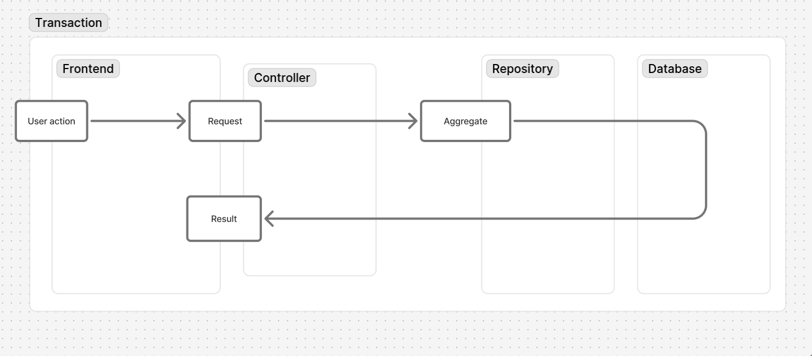

# Transaction

The path data traces through a write operation: from a request, through validation, through mutation, into persistence and back — scoped so the whole path appears atomic from the outside

A transaction is what changes the state of a [concept](/concepts/concepts/Concept.md)'s [real volume](/concepts/classes/RealVolume.md). A concept itself has no state — it has a name, attributes, and kinds. Its real volume, the set of its actual instances in the modeled reality, is what has state. Because that real volume is often mutable, a concept usually has one or more transactions: create, update, delete, and any domain-specific state change.

<p align="center">
  
</p>

"Transaction" is meant in the broad, distributed-systems sense, not narrowly a single database `COMMIT`. A transaction's boundary is defined by atomicity, not by mechanism: a single SQL transaction is the common case, but a saga coordinating multiple services with compensating actions is a transaction too — it is sometimes called a distributed transaction for exactly this reason. What makes something a transaction is that it is reasoned about, and either fully applied or fully undone, as one unit — not which mechanism enforces that.

**Structure:**

A transaction's path spans application layers — from a concept's frontend repository mutation method to the database and back. It is a [cohesion](/concepts/substances/Cohesion.md) unit below the concept: it must contain the whole vertical slice across layers the data's path passes through, not a fragment of it.

A transaction encapsulates:

- input constraints - what makes the requested change valid
- rate limiting - how often the triggering subject is allowed to run this transaction
- transport - how the request reaches the transaction and how the result returns
- database queries (or, for a saga, calls to the services/steps involved) - how the change is carried out and, if it fails partway, undone
- caching - how caches are invalidated or updated as a result
- state manipulation - the actual mutation of the concept's real volume

## Boundary

A transaction's boundary is its atomicity boundary. Everything the transaction does happens within one atomic unit, and that unit's scope is exactly the transaction's scope — not narrower (split into several unrelated atomic units) and not wider (bundled with unrelated writes). This is what lets a transaction be reasoned about as a single thing: constraint checking and state manipulation only stay coherent together if the underlying mechanism actually enforces that atomicity, whether that mechanism is a database transaction or a saga's compensation logic.

## Relation to Repository

A [repository](/concepts/repositories/Repository.md) exposes read and write access to a concept's real volume, but does not by itself say where a write's atomicity boundary lives, or where its input constraints and caching concerns are encapsulated.

A transaction is the answer: it is the unit that owns the atomicity boundary for one state change, together with the constraints and side effects (caching, transport) that belong to that change. A repository's write methods are the reflections a transaction calls into to touch the database; the transaction is the cohesion unit that ties those calls to the constraints and side effects surrounding them, and it is also what defines where the atomic unit starts and ends.

## Relation to Aggregate

DDD's Aggregate is the validated input to a transaction: a cluster of entities gathered under one root entity, held together by an invariant that must never be false, checked across the whole cluster at once. It is loaded already satisfying that invariant, before the transaction's path through the data begins, and it is what the requested change is checked against and applied to. The request payload (typically value-object-shaped: no identity, just data) is also input, but it arrives unvalidated — the aggregate is the input that is already known-valid, and that must still satisfy its invariant once the transaction's mutation is applied.

An aggregate's boundary is drawn by asking what must be true together, atomically, with no exceptions; anything not required by the invariant stays outside, referenced only by id. That is the same question a transaction's boundary answers, which is why the two mostly coincide: the aggregate is the persisted, standing shape of the data whose invariant a transaction exists to enforce, and the transaction is the path that data takes to load it, check it, mutate it, and re-persist it, atomically.

## Relation to Command

A [command](/concepts/commands/Command.md) is any action a [subject](/concepts/subjects/Subject.md) asks a system to perform, including ones that only start a [process](/concepts/processes/Process.md) or produce feedback without changing state.

Every transaction is a command: it runs when its triggering subject — a person, a cron job, another process — asks for the state change. Not every command is a transaction — some only start a process or produce feedback without changing state.

A transaction is transport-independent: it does not require a CLI command, HTTP route, or any other entry point to exist as a concept. But when one of those entry points is built for it, the transaction is the natural use-case boundary — the entry point becomes a thin controller that calls into the transaction and nothing more. In that case, give the transaction the same namespaced identifier as its exposed command (e.g. an `orders:create` CLI command calling a transaction also named/identified as `orders:create`), rather than inventing a separate name for each. The two are reflections of the same identity, and sharing the identifier keeps them discoverable together.

## Placement

A concept, [stakeholder](/concepts/stakeholders/Stakeholder.md), or [tool](/concepts/tools/Tool.md) may have a `transactions` directory (also written `Transactions`, matching the surrounding naming convention) directly under its own directory. Each subdirectory of it corresponds to one transaction, named after that transaction alone (e.g. `create`, not `orders:create`) — its namespaced identifier is the concept's name and the subdirectory's name glued with `:`, not something the directory name needs to spell out itself. The files inside the subdirectory are that transaction's implementation across whichever application layers it touches. Everything that implements a transaction belongs inside its subdirectory — nothing about that transaction's constraint checking, transport, persistence, or caching lives outside it.

A transaction's end-to-end [tests](/concepts/tests/Tests.md) belong in its subdirectory too, following the same reasoning that puts other tests near what they test. A real e2e test drives the transaction from the frontend — e.g. a Playwright test that drives the UI action that triggers the request — through transport, persistence, and caching, so it belongs with the transaction, not in a separate `/tests` or `/e2e` directory grouped by test type.

**Examples:**

```
/concepts/orders/
  transactions/
    create/
      CreateOrder.php            # constraints, persistence, cache invalidation
      CreateOrderController.php  # transport
      CreateOrder.e2e.ts         # Playwright test driving the UI action end-to-end
    cancel/
      CancelOrder.php
  Order.php                  # order entity representation
  OrdersRepository.php       # order persistence representation, called into by transactions
```

Because every `transactions` directory follows this fixed pattern, tooling can find every transaction in a project by scanning tracked files for path segments named `transactions`/`Transactions` and listing the directory right after them. Scanning tracked files rather than the working tree means gitignored transactions are skipped. See `cdd transactions:list` in [CDD CLI Commands](/concepts/cdd-cli-commands/CDD CLI Commands.md).

The runtime mechanism a transaction uses — HTTP endpoint, queue job, CLI command — is irrelevant to which transaction it belongs to, same as for any other [reflection](/concepts/reflections/Reflection.md).
